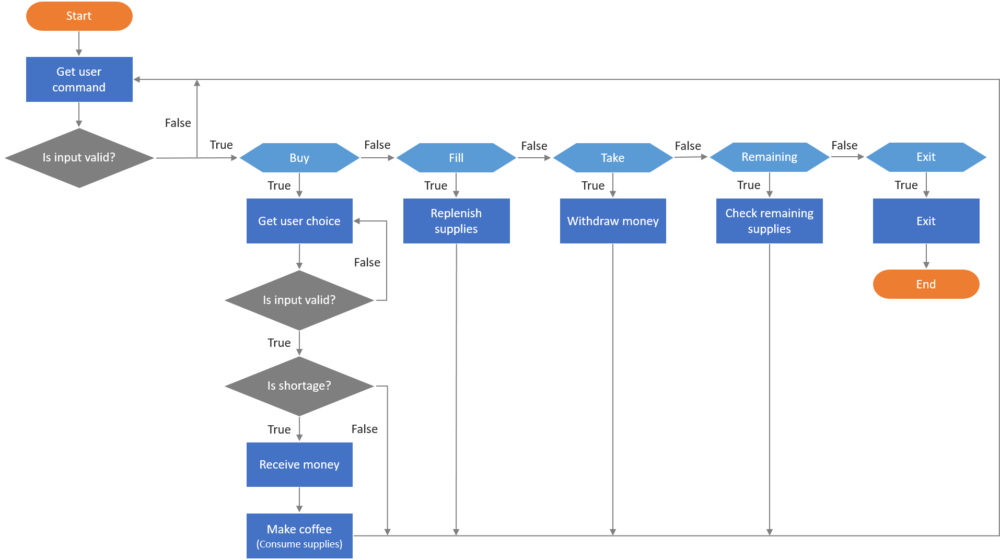
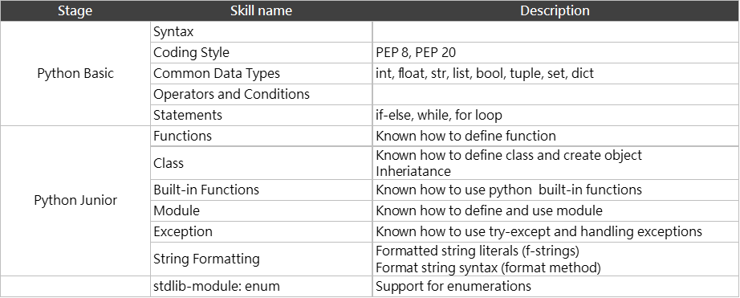

# Coffee Machine Simulator

## Introduction
This project is base on a practice from [JetBrains Academy](https://hyperskill.org/projects/68), but I change some part to satisfied myself.
`coffee-machine-simulator` is tring to make a process for a virtual coffee machine.
But it's only for practice, not involve in any issues of hardware or system.
It's allow user to:
1. Buy a cup of coffee.
2. Fill supplies into machine.
3. Take the money from machine.
4. Exit and stop the machine.

## About
Run this program locally by:
```
python main.py
```
or import to your program by:
```
from coffeemachine import CoffeeMachine
cfm = CoffeeMachine(water=400, milk=540, beans=120, cups=9, money=550)
cfm.run()
```

## The flow chart




## Python skill reference
For self assessment, I made a list as a reference. (And it's highly subjective)


