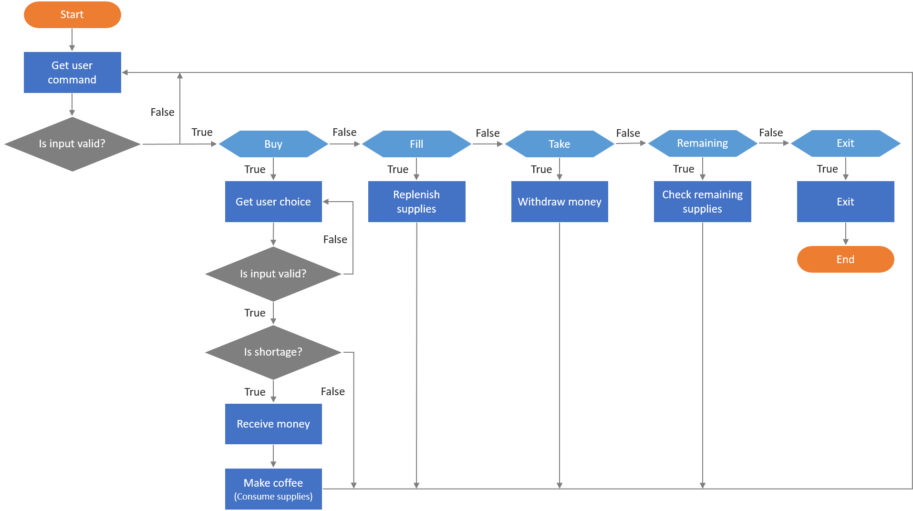
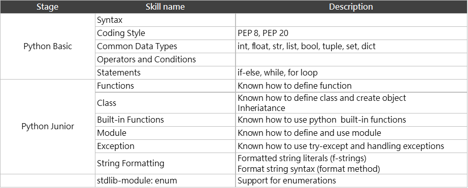

# 咖啡機模擬器

## 前言
這個專案的題目是基於 [JetBrains Academy](https://hyperskill.org/projects/68) 中的一個練習, 不過我按自己的意思加了些調整。
`coffee-machine-simulator` 的目標是去模擬辦公室常見的自動咖啡機的程序。
但是僅只於軟體邏輯的練習，沒有考慮任何硬體溝通或其他外部系統的事情。
這台機器可以讓使用者 :
1. 買一杯咖啡
2. 對機器填充物料
3. 從機器中取出現金
4. 離開並關閉機器

## 關於
在本機端執行的方法 :
```
python main.py
```
或著，導入到你的 Python 檔使用:
```
from coffeemachine import CoffeeMachine
cfm = CoffeeMachine(water=400, milk=540, beans=120, cups=9, money=550)
cfm.run()
```

## 流程圖




## 相關的 Python 技能參考
這張表主要是為了自我檢視使用（所以非常主觀）。


